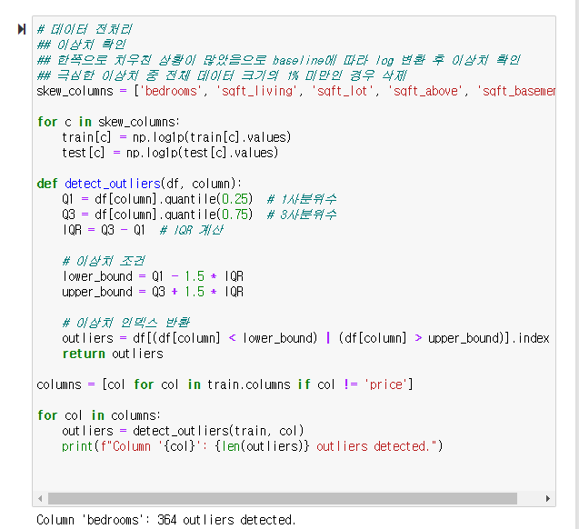
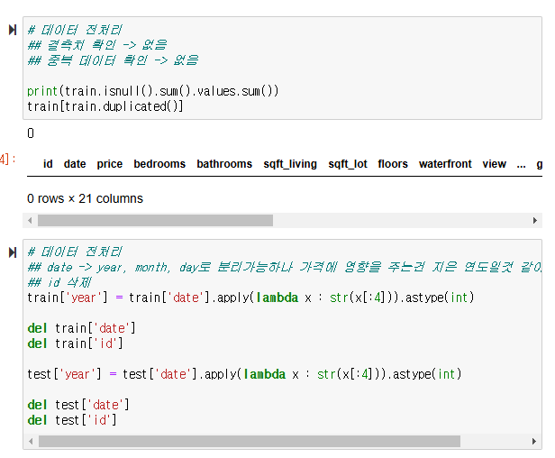
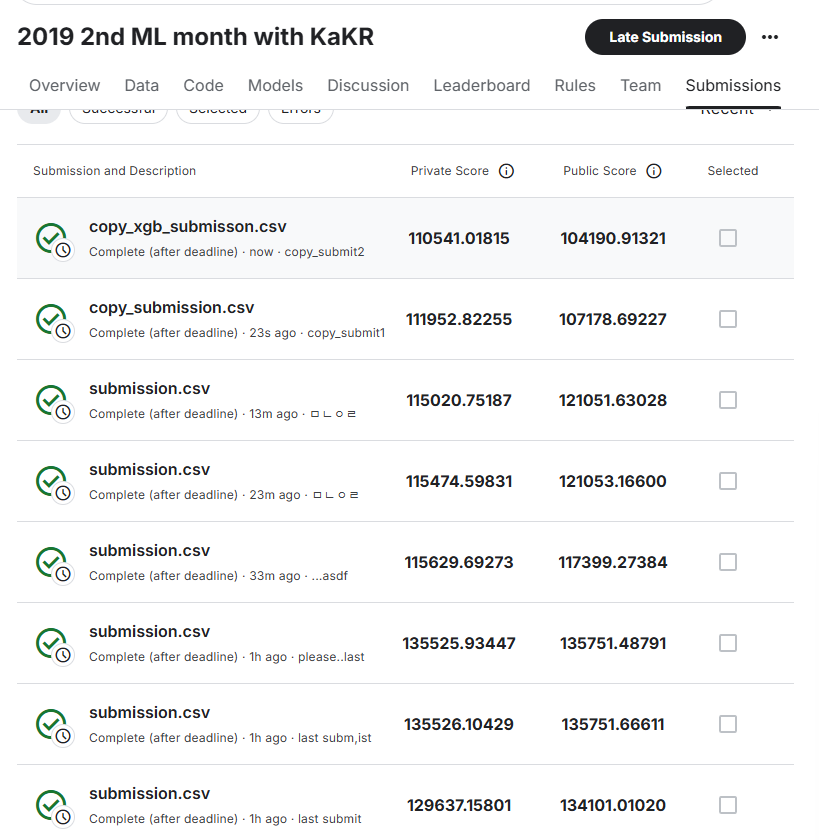

# AIFFEL Campus Online Code Peer Review Templete

- 코더 : 조성우
- 리뷰어 : 김강우

# PRT(Peer Review Template)

- [] **1. 주어진 문제를 해결하는 완성된 코드가 제출되었나요?**
  - 문제에서 요구하는 최종 결과물이 첨부되었는지 확인
    - 중요! 해당 조건을 만족하는 부분을 캡쳐해 근거로 첨부
    
- [x] **2. 전체 코드에서 가장 핵심적이거나 가장 복잡하고 이해하기 어려운 부분에 작성된 주석 또는 doc string을 보고 해당 코드가 잘 이해되었나요?**
      - 해당 코드 블럭을 왜 핵심적이라고 생각하는지 확인
      - 해당 코드 블럭에 doc string/annotation이 달려 있는지 확인
      - 해당 코드의 기능, 존재 이유, 작동 원리 등을 기술했는지 확인
      - 주석을 보고 코드 이해가 잘 되었는지 확인
      - 중요! 잘 작성되었다고 생각되는 부분을 캡쳐해 근거로 첨부
      

- 현재 페이지에서 데이터에 대한 이해부터 시작하는 부분이 인상적으로 느꼈습니다. 데이터를 대충 지나가는 사람들이 있는 반면, 데이터를 충분히 이해하고 시작하는 부분이 인상적입니다.

- 현재 페이지에서는 전처리를 진행하였습니다. 현재 페이지에서는 print문에서도 충분이 이해하기 쉽도록 작성되어 좋았습니다. 또한 주석 처리도 좋았습니다.
      
- [x] **3. 에러가 난 부분을 디버깅하여 문제를 해결한 기록을 남겼거나
      새로운 시도 또는 추가 실험을 수행해봤나요?** - 문제 원인 및 해결 과정을 잘 기록하였는지 확인 - 프로젝트 평가 기준에 더해 추가적으로 수행한 나만의 시도,
      실험이 기록되어 있는지 확인 - 중요! 잘 작성되었다고 생각되는 부분을 캡쳐해 근거로 첨부

- 현재 이미지에서 버전 충돌로 인해 해결중이어서 과제를 완료하기 어려운 것을 들었습니다.

- 현재 이미지에서는 충분한 주석이 달려있는 것을 확인 가능합니다. 데이터를 분석하기 위한 충분한 과정을 주석으로 표현하였습니다. 
      
- [] **4. 회고를 잘 작성했나요?**
  - 주어진 문제를 해결하는 완성된 코드 내지 프로젝트 결과물에 대해
    배운점과 아쉬운점, 느낀점 등이 기록되어 있는지 확인
  - 전체 코드 실행 플로우를 그래프로 그려서 이해를 돕고 있는지 확인
    - 중요! 잘 작성되었다고 생각되는 부분을 캡쳐해 근거로 첨부
    
- [x] **5. 코드가 간결하고 효율적인가요?**
  - 파이썬 스타일 가이드 (PEP8) 를 준수하였는지 확인
  - 코드 중복을 최소화하고 범용적으로 사용할 수 있도록 함수화/모듈화했는지 확인
    - 중요! 잘 작성되었다고 생각되는 부분을 캡쳐해 근거로 첨부


- PEP8을 잘 모르지만 전형적인 파이썬 스러운 스타일을 유지하면 작성하였다고 느꼈습니다. 파이썬 스타일을 충분히 준수했다고 생각합니다. 
  
  
# 회고(참고 링크 및 코드 개선)

```
리뷰 세션 이유 새벽 3시 까지 노력해봤지만 점수 달성이 안되어서 제출을 위해 다른 분들이 올려놓은 코드를 활용하여 점수 달성하고 마무리 했습니다.

다른 분들이 작성한 코드는 케글의 Code 탭에서 찾았으며 현재 프로젝트에 copy가 포함된 파일들은 해당 Code 탭에서 찾은 내용을 활용한 것입니다.

이번 프로젝트 진행하면서 문제점은 크게 2가지 였습니다.
1. 로컬에서 코드를 실행시킬 경우 버전 충돌 문제가 너무 많이 발생하여 이를 해결하는데 시간이 많이 걸렸습니다.
2. 로그 스케일 변환을 적용시켰을 때 성능이 더 나빠지는 원인을 찾지 못했습니다. 다른 분들의 코드를 봐도 역시 로그 스케일 변환을 적용하는게 맞는 것 같은데 제가 작성한 코드에서는 어떤 문제로 오히려 악영향을 끼쳤었는지 추후에 파악하여 현재 회고란에 작성해놓겠습니다.

```
