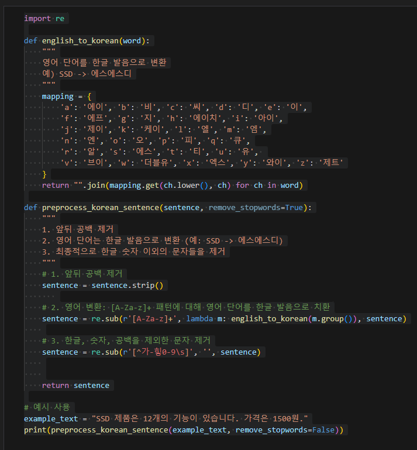
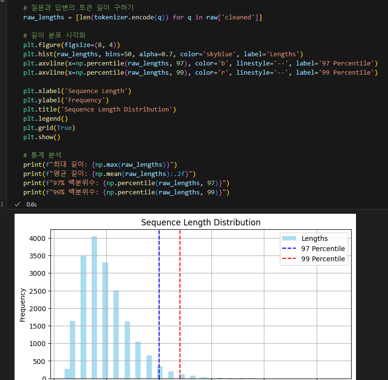
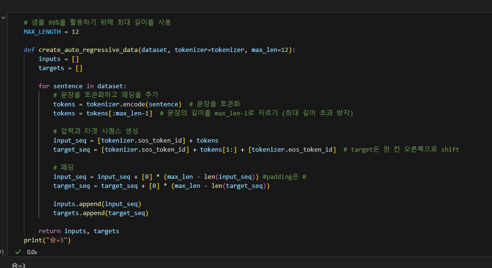
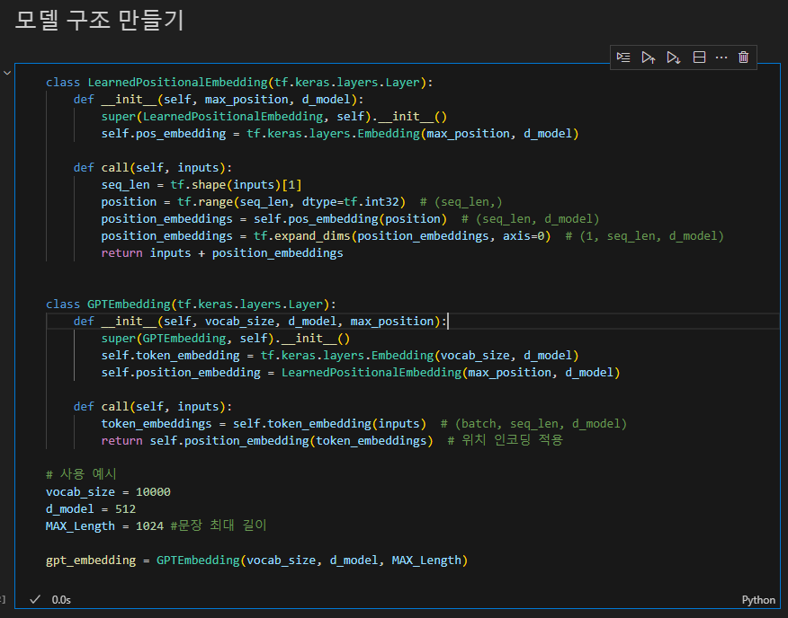
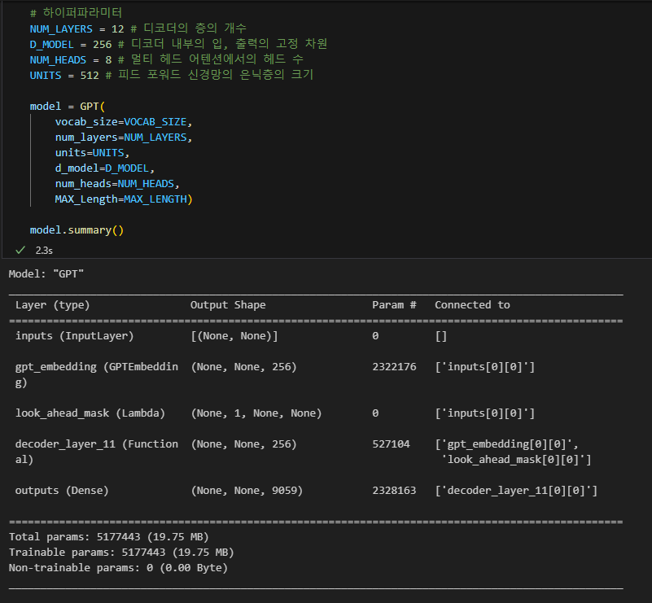
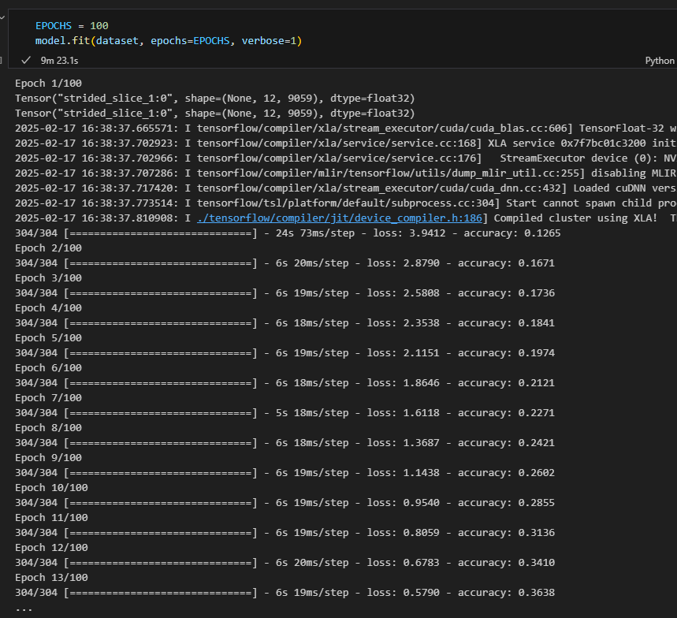
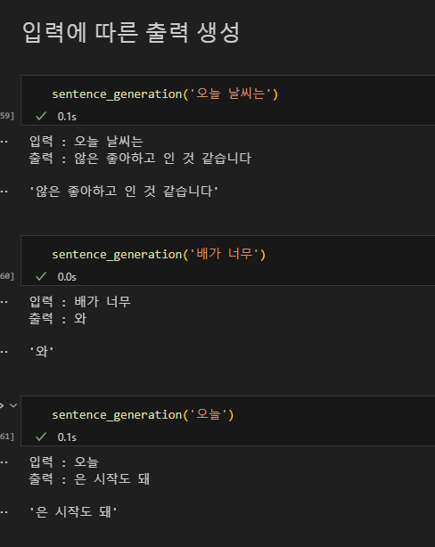

### 1. Transformer와 비교해 변경이 필요한 부분
- positional encoding을 따로 추가하는게 아니라 Embedding layer에서 같이 학습될 수 있도록 구성해야함
- Encoder-Decoder 구조가 아닌 Decoder만 활용한 모델 구조로 변경
- masked self Attention만 사용하므로 look ahead mask만 활용
- Unsupervised Learning 이므로 pre-training시 target 데이터는 입력 데이터를 right-shift 시킨 형태로 구성

### 2. 모델의 입력 형태에 맞게 전처리를 수행
- 전처리
    * 
    * 

### 3. 모델의 입력 블럭을 GPT 논문에 기반하여 수정

#### 모델의 input 구성
* 모델 입력 구성 결과
    - 
    - 

* 데이터 위치 정보 추가
    - 

### 4. GPT 모델을 정상적으로 구성하였는지

1. model.summary 결과
    - 

2. model.fit 결과
    - 

### 5. 입력에 따른 출력 생성

- 
